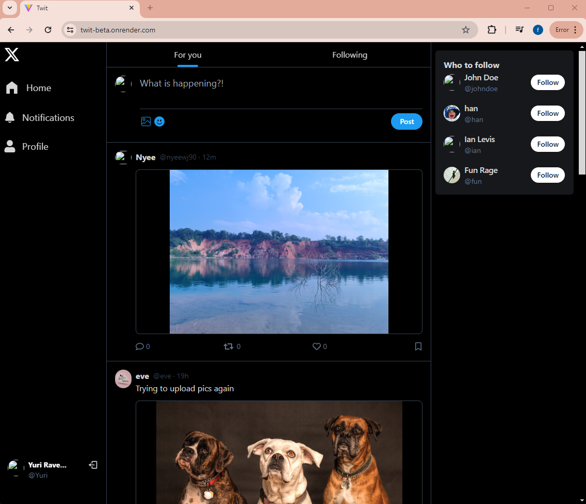

#Project4
#twit

This is a twitter clone. A BASIC one.
This main function is to share status/news with an option of uploading ONE picture.
One could also follow users , like a post, delete posts.
Users are able to edit their profiles.

Click here to try : https://twit-beta.onrender.com

*Technology Used*

    bcryptjs": "^2.4.3
    cloudinary": "^2.2.0
    cookie-parse": "^0.4.0
    cookie-parser": "^1.4.6
    cookieparser": "^0.1.0
    cors": "^2.8.5
    dotenv": "^16.4.5
    express": "^4.19.2
    jsonwebtoken": "^9.0.2
    mongoose": "^8.4.1

    Vite
    Tailwind - daisyUI

*Future Development* 
 Retweet post function and Saved post Function
